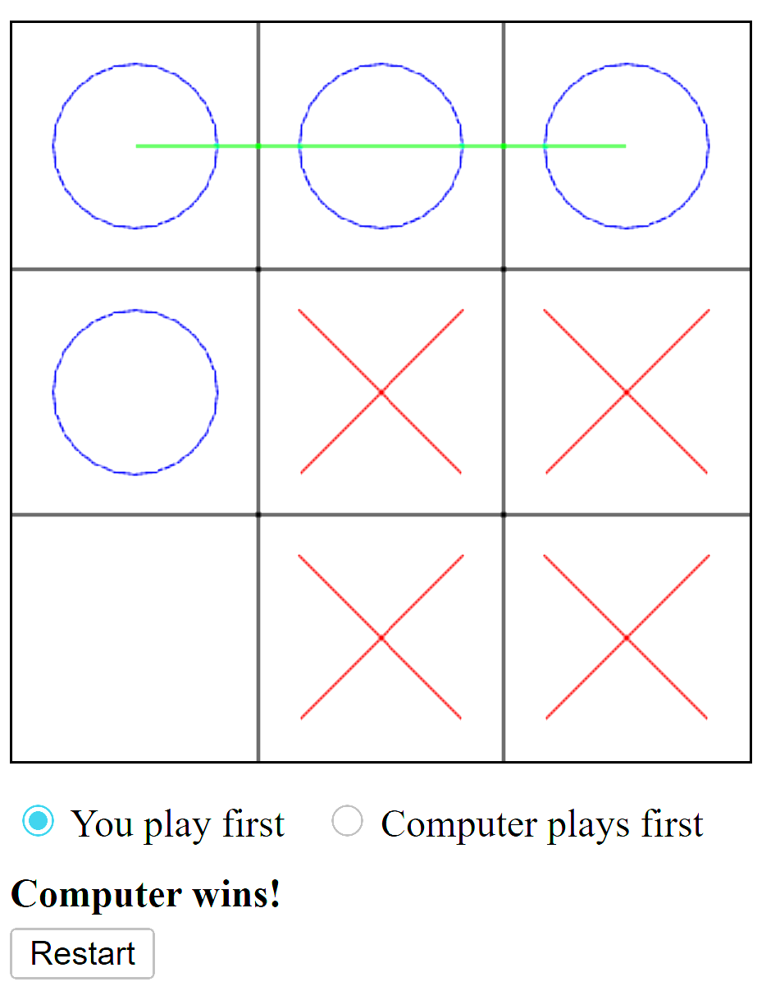

# Tic-Tac-Toe

A simple command-line Tic-Tac-Toe game written in Rust.



## Prerequisites

- [Rust](https://www.rust-lang.org/tools/install) toolchain installed. This provides the `cargo` command used to build and run the project.

## Running the game

Execute:

```bash
cargo run
```

The program will compile and launch an interactive Tic-Tac-Toe session in your terminal.

## Running tests

Unit tests are included for core game logic. Run them with:

```bash
cargo test
```


## WebAssembly/WebGL Frontend

A basic WebGL frontend is provided in the `web` folder. Build the WebAssembly package using [`wasm-pack`](https://github.com/rustwasm/wasm-pack):

```bash
wasm-pack build wasm --target web
```

To play in a browser you'll need to serve the files over HTTP. Because the
frontend loads resources from `../wasm`, start the server from the repository
root. On Linux you can use Python's built-in server:

```bash
python3 -m http.server 8000
```

Then navigate to `http://localhost:8000/web` in your browser.
